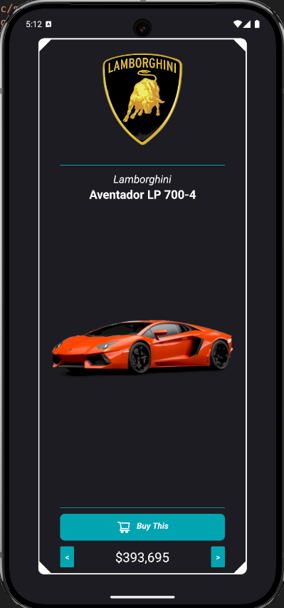

# Galleria Lamborghini: Uma Vitrine em React Native

## 📖 Sobre o Projeto

**Galleria Lamborghini** é um aplicativo móvel, construído com React Native, que exibe uma lista de carros icônicos da Lamborghini consumindo dados de uma API.

Este projeto foi desenvolvido como um laboratório prático para aprimorar habilidades essenciais no desenvolvimento mobile, focando em:

* **Consumo de APIs:** Prática de requisições HTTP para buscar, exibir e gerenciar dados externos.
* **Organização de Código:** Implementação de uma estrutura de pastas modular e limpa.
* **Componentização Escalável:** Construção de componentes de UI reutilizáveis, de fácil manutenção e com foco em performance.

O resultado é uma aplicação fluida e visualmente atraente, que serve como uma excelente demonstração de competências técnicas em React Native.

## ✨ Funcionalidades Principais

* **Listagem Dinâmica:** Visualização dos carros da Lamborghini obtidos em tempo real a partir da API.
* **Componente de Card:** Cada carro é exibido em um card customizado com informações essenciais (modelo, foto).
* **Interface Moderna:** Um design limpo e elegante, inspirado na própria marca Lamborghini.

## 📱 Telas do App

| Tela de Listagem de Carros |
| :-------------------------: |
|  |

## 🚀 Tecnologias e Conceitos Aplicados

* **[React Native](https://reactnative.dev/)**: Framework principal para o desenvolvimento do app.
* **[Expo](https://expo.dev/)**: Plataforma para facilitar o build e o desenvolvimento.
* **[JavaScript](https://developer.mozilla.org/pt-BR/docs/Web/JavaScript)** / **[TypeScript](https://www.typescriptlang.org/)**: Linguagem base com tipagem estática para um código mais robusto.
* **Consumo de API**: Utilização da **API Fetch** ou da biblioteca **[Axios](https://axios-http.com/)** para comunicação com o backend.
* **Hooks do React**: `useState` para gerenciamento de estado local e `useEffect` para controle de ciclo de vida e efeitos colaterais (como as chamadas de API).
* **Estrutura de Projeto**: Código organizado em pastas como `src/components` e `src/screens` para máxima escalabilidade.

## 🛠️ Como Executar o Projeto

Siga os passos abaixo para rodar o projeto em seu ambiente de desenvolvimento.

### Pré-requisitos

* [Node.js](https://nodejs.org/en/) (versão 18 ou superior)
* [Yarn](https://classic.yarnpkg.com/) ou [NPM](https://www.npmjs.com/)
* [Expo Go](https://expo.dev/client) instalado em seu smartphone (iOS ou Android)

### Instalação

1.  **Clone este repositório:**
    ```bash
    git clone https://github.com/dsanchezsantos/lamborghini-garage
    ```

2.  **Navegue até o diretório do projeto:**
    ```bash
    cd lamorghini-garage
    ```

3.  **Instale as dependências:**
    ```bash
    yarn install
    # ou
    npm install
    ```

### Configurando a API

Antes de iniciar, certifique-se de configurar a URL da API.

* No diretório `src/constants/`, localize o arquivo `car.ts` (ou crie um).
* Insira a URL base da sua API de carros, como no exemplo abaixo:

    ```javascript
    export const CAR_API_BASE_URL = "https://digitalinnovationone.github.io/fake-data-api-lamborghini/api/lamborghini.json"
    ```

### Iniciando o App

1.  **Execute o servidor de desenvolvimento:**
    ```bash
    npx expo start
    ```
2.  Abra o aplicativo **Expo Go** em seu celular e escaneie o QR Code que aparece no terminal.

## 📝 Licença

Este projeto está sob a licença MIT. Veja o arquivo [LICENSE](LICENSE) para mais detalhes.

---

Desenvolvido por **[Diogo Sanchez]** 👋 Entre em contato!

[
[
